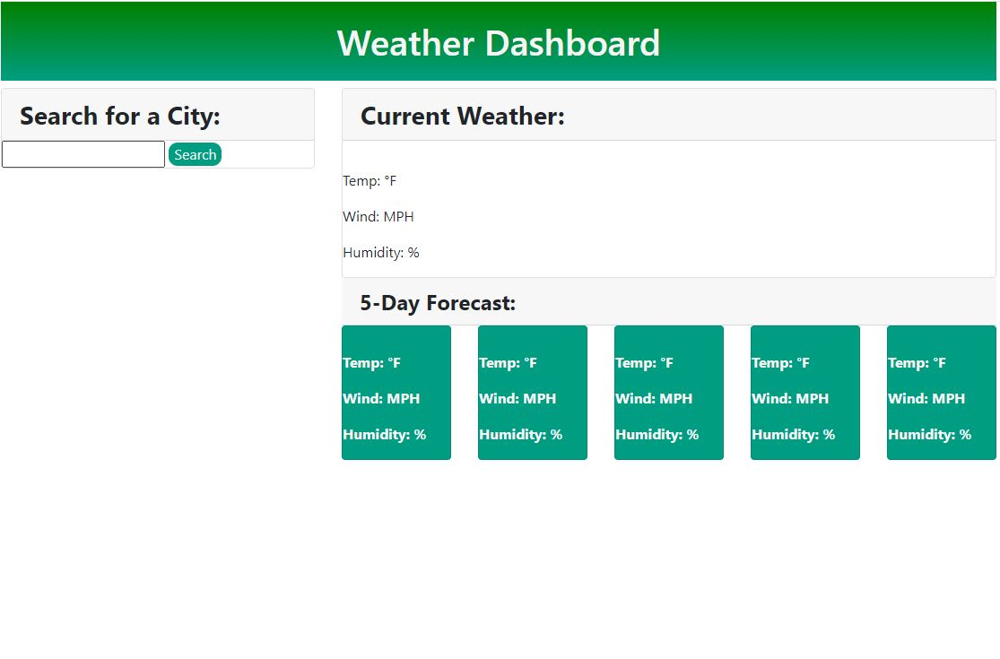

# Weather Dashboard

## Description

This project is a web app that uses OpenWeather One Call API to display the current and future weather outlook for multiple cities. The goal is to help travelers plan their trips and pack accordingly based on weather predictions for their destinations.

## Built With

-HTML
-CSS
-OpenWeather One Call API

## Website

[GitHub] (https://natasharrison.github.io/weather-dashboard/)
[Screenshot] 

## Contribution

- Created by Natasha Harrison
